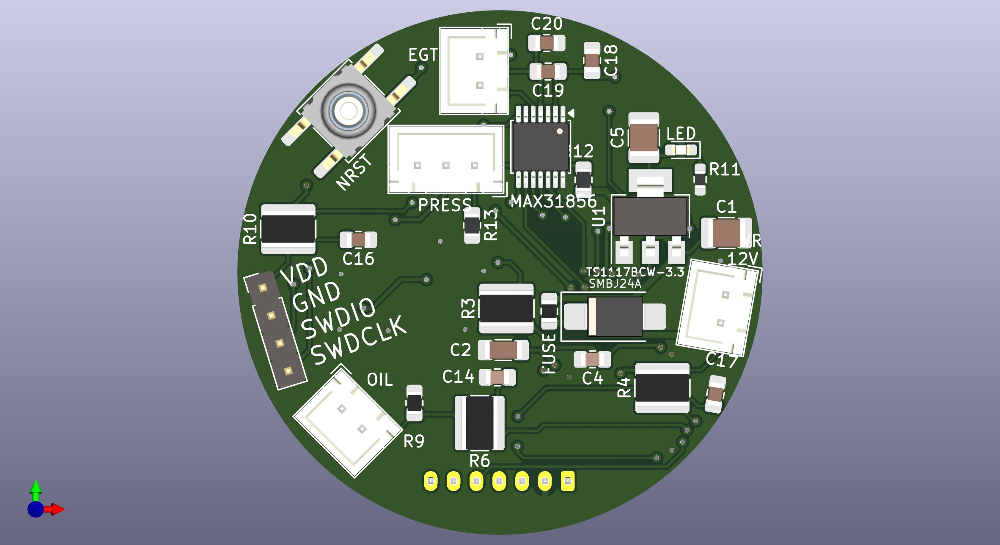
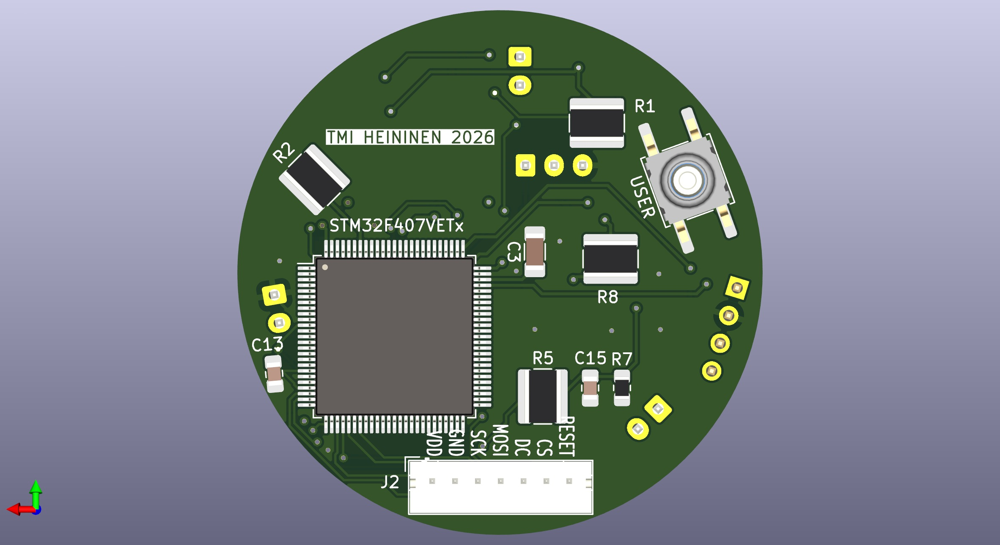
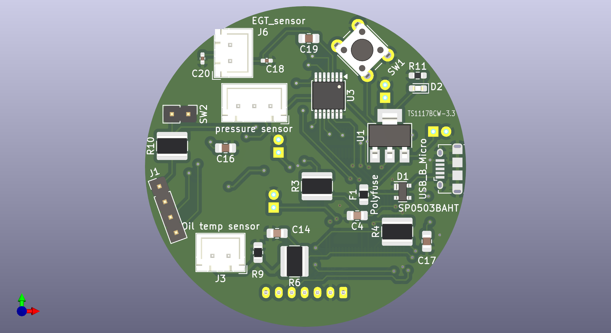
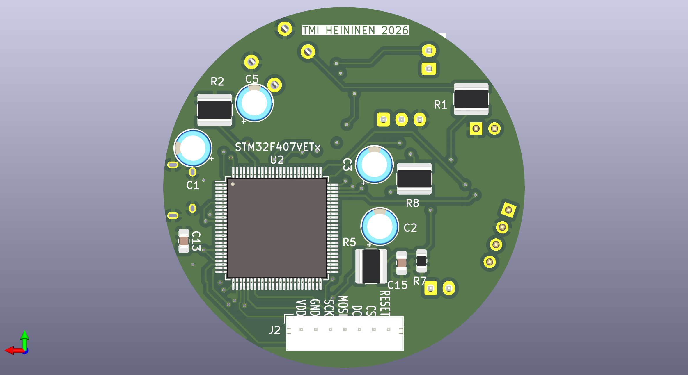

# stm32screen

PCB designed to fit into a 52mm closure and interface with some car sensors and stuff

10.6.2026
Ordered PCBs from KiCad. Changed made to previous version pictured below these new ones are disposing of the USB connector entirely and with it, the SP0503BAHTG TVS diode, adding a user switch, Adding better labels on the silkscreen, slightly better layout, disposing of THT caps. The board will be powered straight from the car's battery, this allows easier installation and decreases cost and complexity.

17.3.2026

